# Deli App Architecture

## Overview

Deli is a mobile-first PWA for ranking dishes using an Elo rating system. Users add dishes they've eaten, compare them head-to-head, and view community leaderboards.

## Tech Stack

| Layer | Technology |
|-------|------------|
| Frontend | React 18 + TypeScript |
| Build | Vite |
| Routing | React Router v6 |
| Styling | TailwindCSS |
| State (Global) | Zustand |
| State (Server) | TanStack Query (React Query) |
| Backend | Supabase (PostgreSQL, Auth, Storage) |
| External APIs | Google Places API |
| PWA | vite-plugin-pwa |

---

## High-Level Architecture

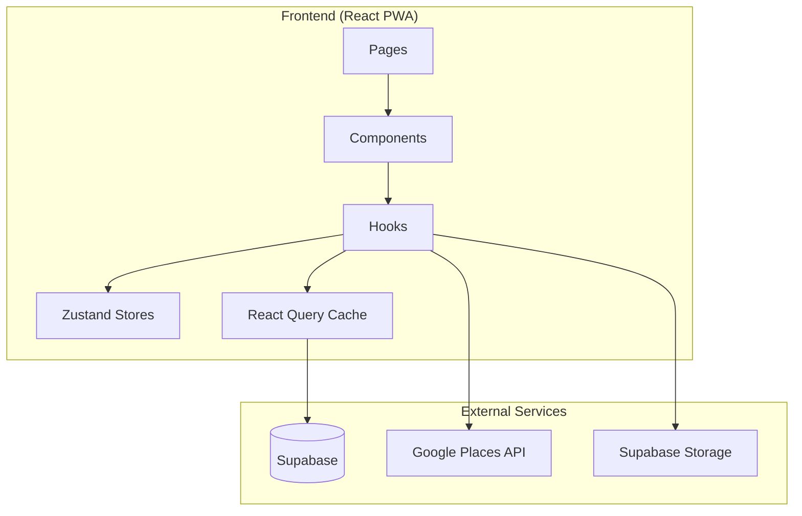

---

## Route Structure

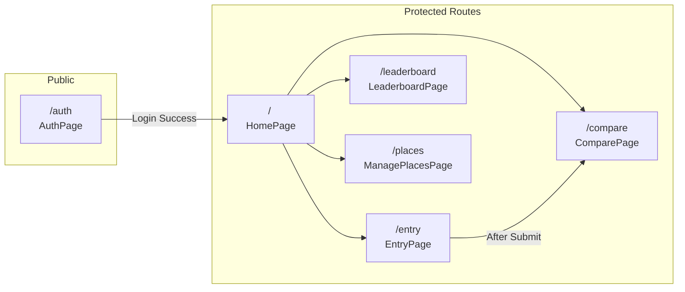

---

## Component Hierarchy

```
App
├── AuthProvider (initializes auth state)
├── QueryClientProvider (React Query)
├── Router
│   ├── /auth → AuthPage
│   └── Layout (Header, OfflineIndicator, SyncIndicator, BottomNav)
│       ├── ProtectedRoute
│       │   ├── / → HomePage
│       │   ├── /entry → EntryPage
│       │   │   └── EntryWizard
│       │   │       ├── DishNameStep
│       │   │       ├── RestaurantStep
│       │   │       │   └── CustomPlaceForm
│       │   │       ├── CuisineStep
│       │   │       └── PhotoStep
│       │   ├── /compare → ComparePage
│       │   │   └── ComparisonView
│       │   │       └── ComparisonCard (x2)
│       │   ├── /leaderboard → LeaderboardPage
│       │   │   ├── LeaderboardFilters
│       │   │   └── LeaderboardList
│       │   │       └── LeaderboardItem (xN)
│       │   └── /places → ManagePlacesPage
│       └── BottomNav
```

---

## Data Flow

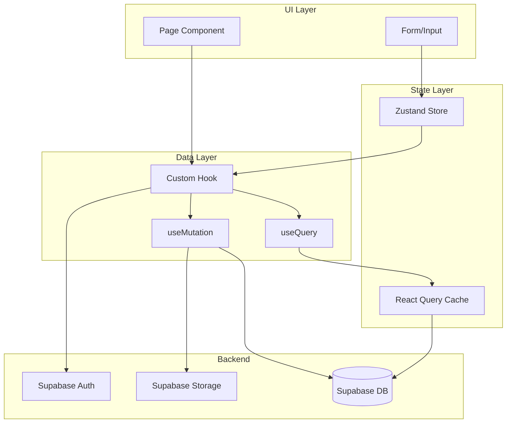

---

## State Management

### Zustand Stores

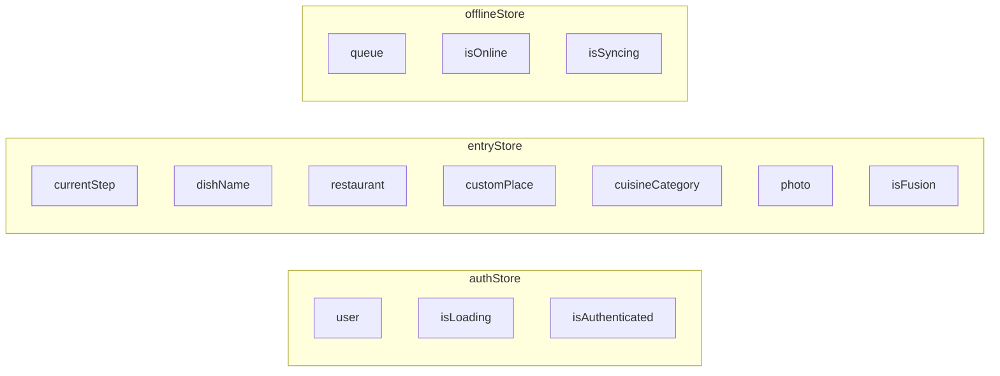

### React Query Keys

| Query Key | Hook | Description |
|-----------|------|-------------|
| `['dishes', 'list', filters]` | `useLeaderboard` | Ranked dishes with filters |
| `['dishes', 'user', userId]` | `useUserDishes` | User's dish entries |
| `['cuisineCategories']` | `useCuisineCategories` | All cuisine categories |
| `['cuisineSubcategories', id]` | `useCuisineSubcategories` | Subcategories for parent |
| `['customPlaces', userId]` | `useCustomPlaces` | User's custom places |
| `['savedHomes', userId]` | `useSavedHomes` | User's saved home locations |

---

## User Flows

### 1. Authentication Flow

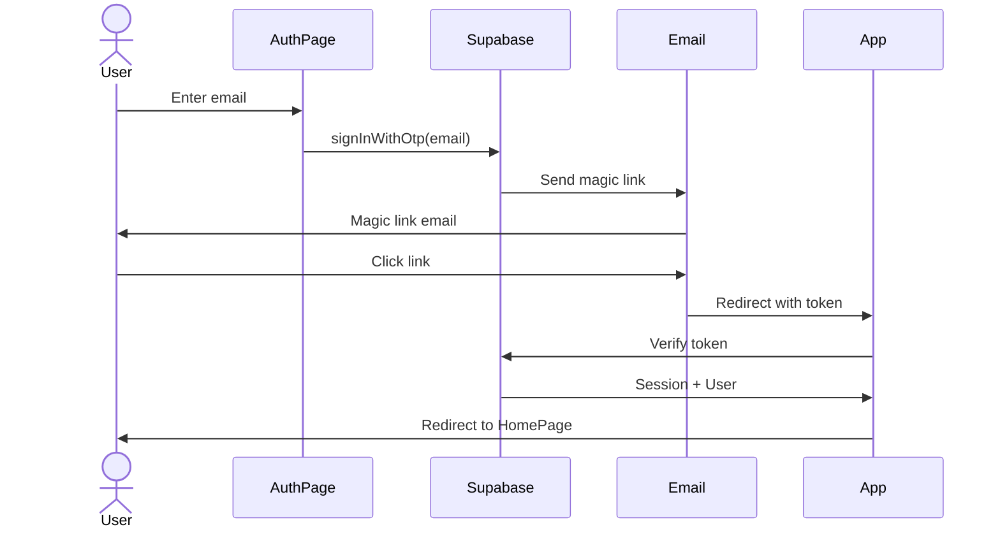

### 2. Add Dish Flow (Entry Wizard)

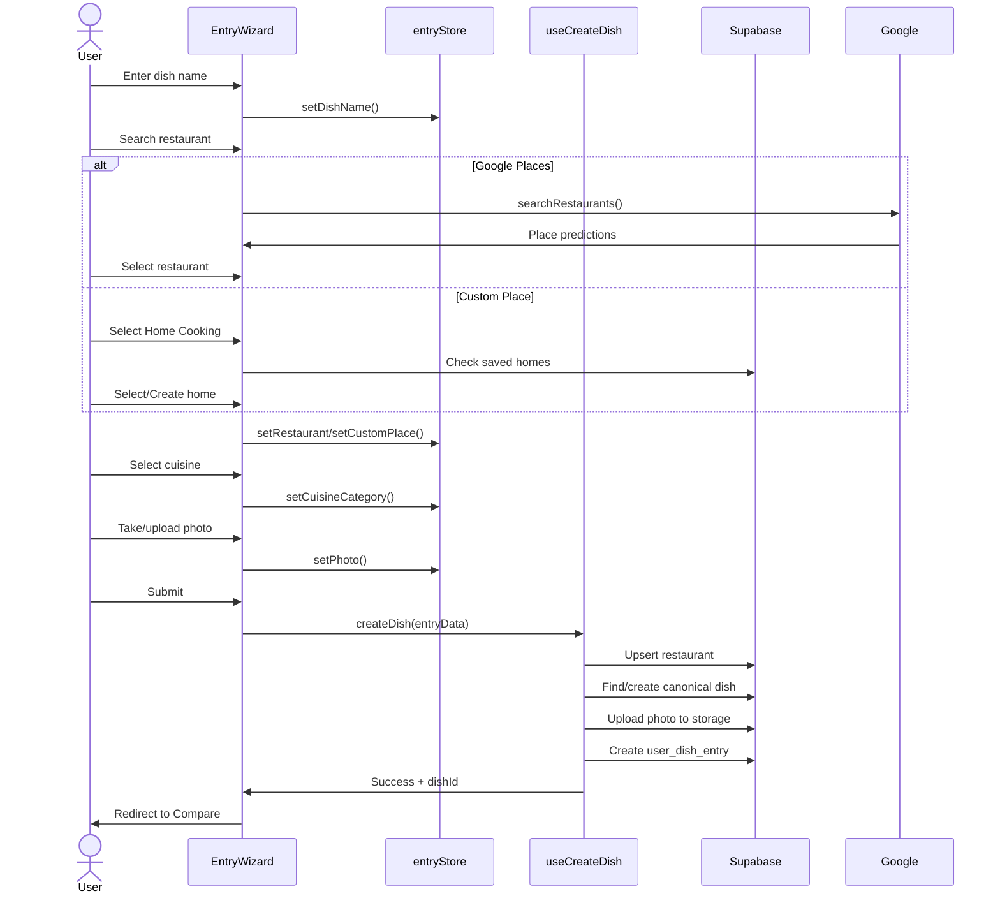

### 3. Comparison Flow

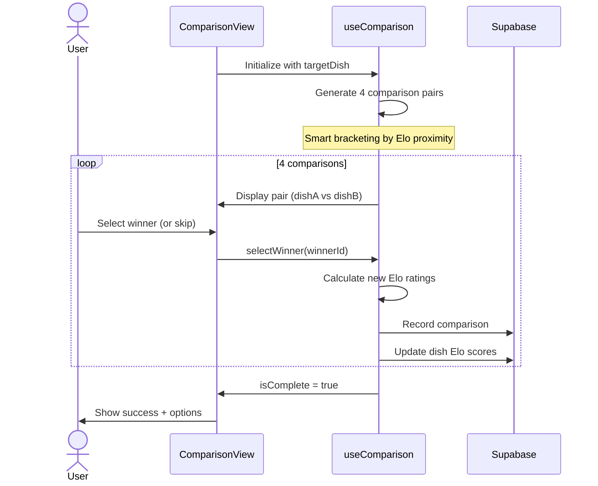

### 4. Offline Sync Flow

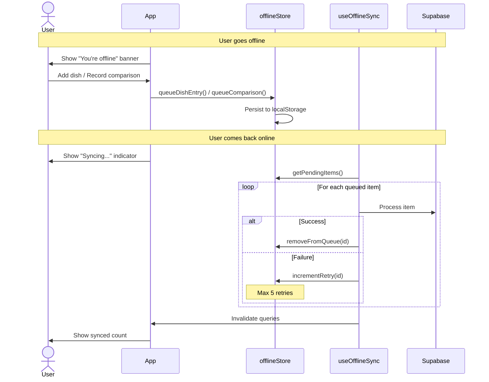

---

## Database Schema

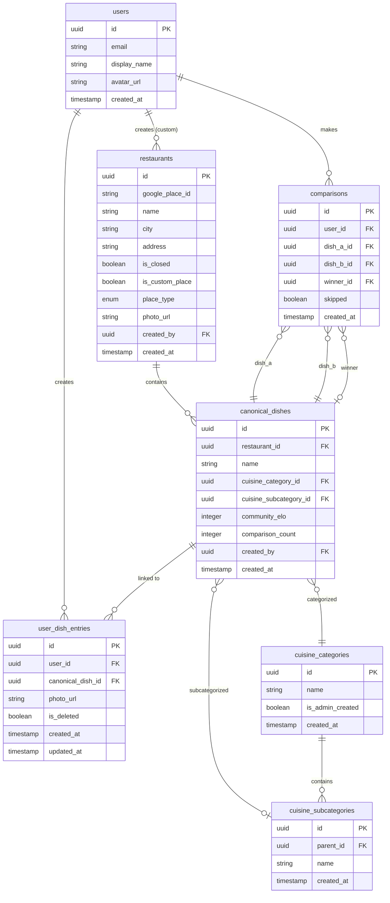

---

## Elo Rating Algorithm

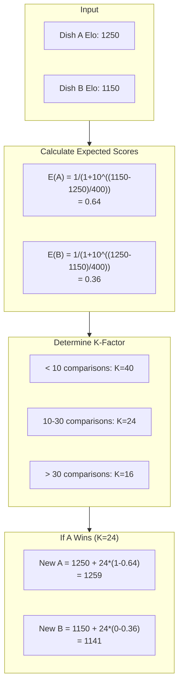

### K-Factor Strategy

| Comparisons | K-Factor | Behavior |
|-------------|----------|----------|
| < 10 | 40 | Volatile - rapid adjustment for new dishes |
| 10-30 | 24 | Stabilizing - moderate adjustments |
| > 30 | 16 | Established - slow, stable changes |

### Cold Start

New dishes start at the average Elo of their cuisine category/subcategory (or 1200 default).

---

## Smart Comparison Bracketing

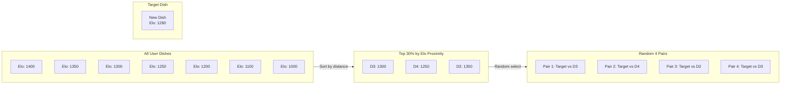

---

## File Structure

```
src/
├── components/
│   ├── comparison/
│   │   ├── ComparisonCard.tsx
│   │   └── ComparisonView.tsx
│   ├── entry/
│   │   ├── CuisineStep.tsx
│   │   ├── CustomPlaceForm.tsx
│   │   ├── DishNameStep.tsx
│   │   ├── EntryWizard.tsx
│   │   ├── PhotoStep.tsx
│   │   └── RestaurantStep.tsx
│   ├── leaderboard/
│   │   ├── LeaderboardFilters.tsx
│   │   ├── LeaderboardItem.tsx
│   │   └── LeaderboardList.tsx
│   ├── layout/
│   │   ├── BottomNav.tsx
│   │   └── Layout.tsx
│   └── ui/
│       ├── Button.tsx
│       ├── Card.tsx
│       ├── Input.tsx
│       ├── Select.tsx
│       └── VersionInfo.tsx
├── hooks/
│   ├── useAuth.ts
│   ├── useComparison.ts
│   ├── useDishes.ts
│   ├── useOfflineSync.ts
│   └── usePlaces.ts
├── lib/
│   ├── elo.ts
│   ├── fuzzyMatch.ts
│   ├── places.ts
│   └── supabase.ts
├── pages/
│   ├── Auth.tsx
│   ├── Compare.tsx
│   ├── Entry.tsx
│   ├── Home.tsx
│   ├── Leaderboard.tsx
│   └── ManagePlaces.tsx
├── stores/
│   ├── authStore.ts
│   ├── entryStore.ts
│   └── offlineStore.ts
├── types/
│   └── index.ts
└── App.tsx
```

---

## PWA Features

| Feature | Implementation |
|---------|----------------|
| Offline Support | Service Worker + Zustand persist |
| Install Prompt | Web App Manifest |
| Icons | pwa-192x192.png, pwa-512x512.png |
| Theme Color | #f97316 (Orange) |
| Display Mode | Standalone |
| Orientation | Portrait |

---

## Security Considerations

- **Authentication**: Supabase magic link (passwordless)
- **Row Level Security**: Supabase RLS policies on all tables
- **Storage**: Authenticated uploads only
- **API Keys**: Google Places key restricted by domain
- **XSS Prevention**: React's built-in escaping
- **HTTPS**: Enforced in production
